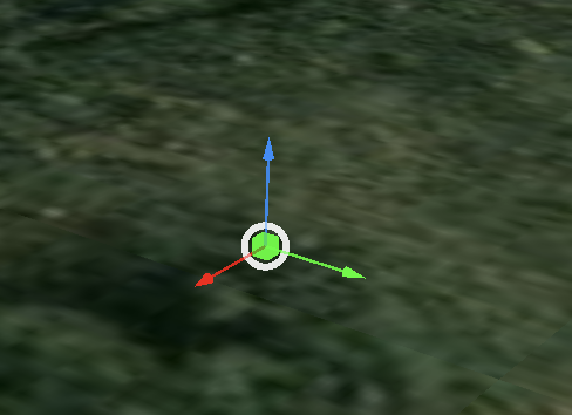
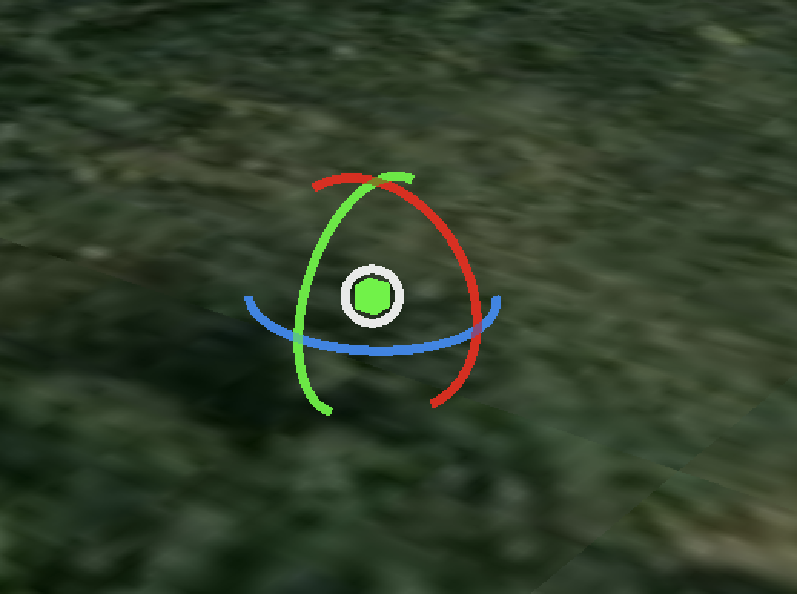
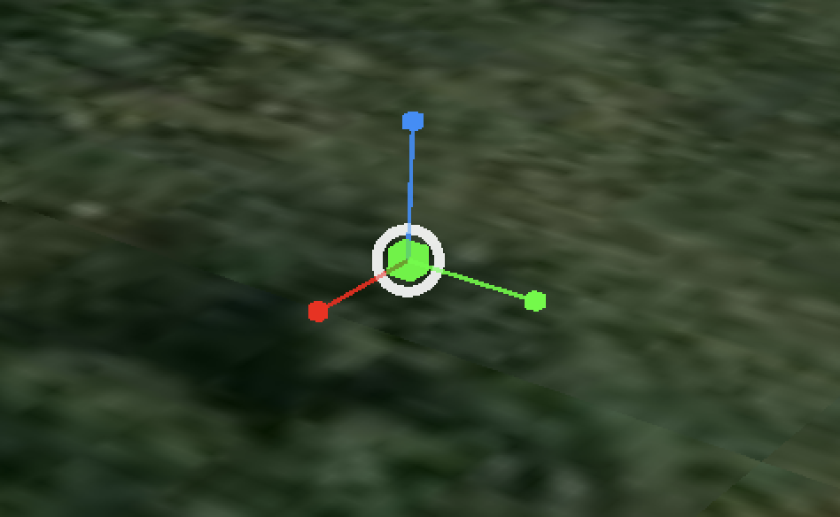

# Cesium Gizmo Controls

[English](./README.md) | [简体中文](./README.zh-CN.md)

面向 Cesium 场景的变换 Gizmo 控件。绑定一个 Cesium `Matrix4`，即可在场景中直接编辑对象的平移、旋转和缩放。







## 功能

- **平移**，沿本地 X、Y、Z 轴移动，或在视图平面内移动。
- **旋转**，绕本地 X、Y、Z 轴旋转，或绕视轴旋转。
- **缩放**，沿本地 X、Y、Z 轴独立缩放，或进行统一缩放。
- 相机移动时，Gizmo 保持目标屏幕尺寸。
- 支持可选的吸附、交互辅助层、拾取容差和可见性阈值。
- 每次交互改变已绑定变换时，都会通过 `onChange` 提供新的 `Matrix4`。

## 演示

在线示例：https://verbannung.github.io/cesium-gizmo-controls/

## 安装

从滚动更新的 GitHub Release 安装：

```bash
npm install https://github.com/verbannung/cesium-gizmo-controls/releases/download/latest/cesium-gizmo-controls-0.1.0.tgz
```

发版构建来自 `main`。日常开发在 `develop` 上进行。

## 要求

- 本地开发需要 Node.js `>=18`。
- Cesium Engine `^24.0.0`。本包将 `@cesium/engine` 声明为 peer dependency。
- Cesium `Matrix4` 必须能够分解为平移、旋转和缩放，形式为 `T · R · S`。`bind()` 会拒绝包含剪切或旋转分量非正交的矩阵。

## 使用方法

```ts
import { Matrix4 } from '@cesium/engine'
import { OrbitControl, type ControlMode } from 'cesium-gizmo-controls'

const control = new OrbitControl(widget.canvas, widget.scene, widget.camera, {
  // 让 Cesium Primitive 与每次控件更新保持同步。
  onChange: (modelMatrix) => Matrix4.clone(modelMatrix, primitive.modelMatrix),
})

control.bind(primitive.modelMatrix, 'translate')

const modes: ControlMode[] = ['translate', 'rotate', 'scale']
control.setMode(modes[1])
console.log(control.currentMode) // 'rotate'

// 销毁 Cesium 视图或其所属对象时调用。
control.destroy()
```

交互过程中，`bind()` 传入的矩阵也会被更新。当其他对象、状态存储或渲染流程需要同步新矩阵时，请使用 `onChange`。

## 公共 API

### `new OrbitControl(canvas, scene, camera, options?)`

为 Cesium canvas、scene 和 camera 创建控件。

### `bind(modelMatrix, mode?)`

绑定可分解的 `Matrix4` 并启用一个模式。`mode` 默认为 `'translate'`。

### `setMode(mode)`

切换当前控件模式。可用模式为 `'translate'`、`'rotate'` 和 `'scale'`。

### `currentMode`

只读的当前模式。

### `destroy()`

移除输入处理器、Gizmo 图元、辅助层和渲染资源。请在销毁时调用。

## 选项

| 选项 | 默认值 | 用途 |
| --- | ---: | --- |
| `gizmoPixelSize` | `80` | Gizmo 的目标屏幕像素尺寸。 |
| `pickPaddingPx` | `8` | 拾取几何体增加的像素宽度。 |
| `translateSnap` | `0` | 平移吸附步长。`0` 会关闭吸附。 |
| `scaleSnap` | `0` | 缩放吸附步长。`0` 会关闭吸附。 |
| `minScale` | `0.01` | 每个轴的最小缩放值。 |
| `showOverlay` | `true` | 是否绘制拖拽引导线、扇形和数值。 |
| `onChange` | `undefined` | 变换更新后接收克隆 `Matrix4` 的回调。 |

高级选项包括 `degenerateThreshold`、`minRotateRadius`、`minScaleDenominator`、`axisLimit` 和 `planeLimit`。它们用于调整退化相机和几何情况附近的交互行为。

## 本地开发

```bash
npm install
npm run dev
npm run build
npm run typecheck
npm run test
```

`npm run dev` 会启动本地 Cesium 示例。`npm run build` 会生成包的构建产物和声明文件。

## 许可证

[MIT](./LICENSE)
